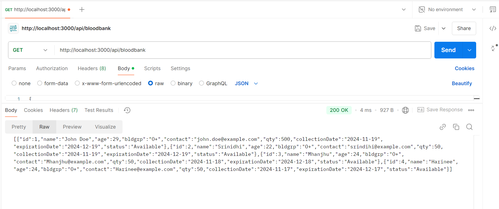
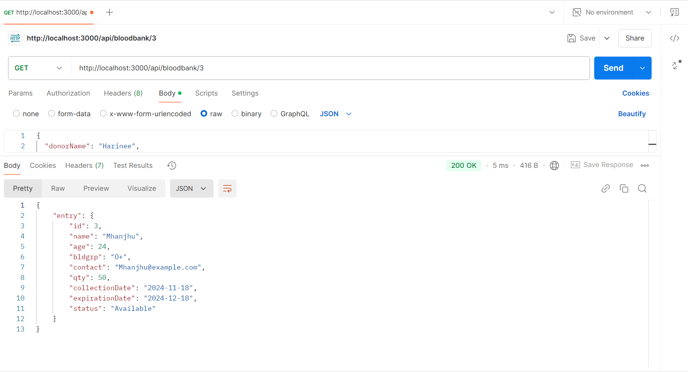
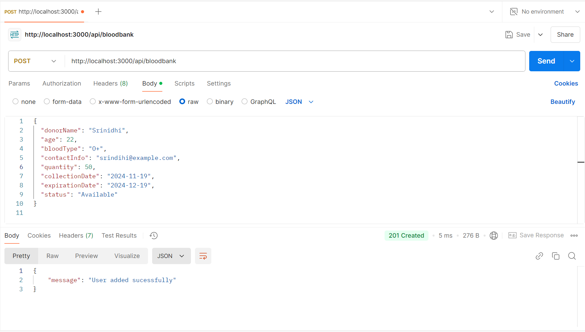
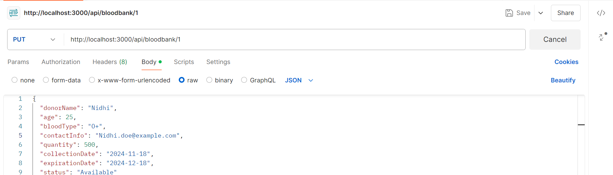
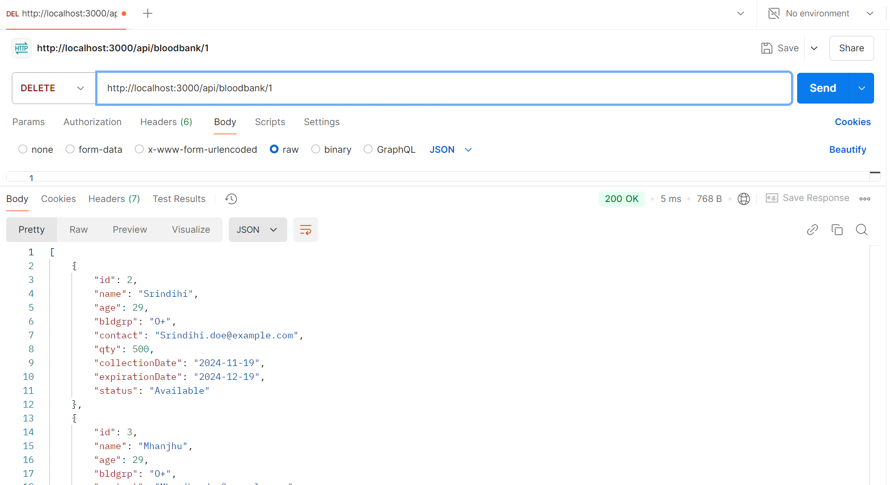
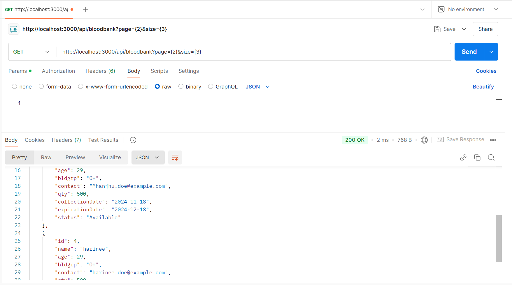
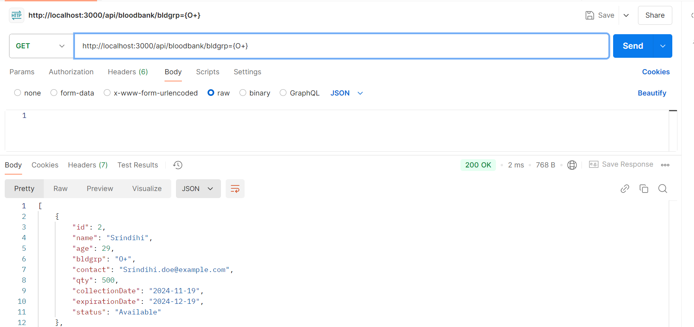
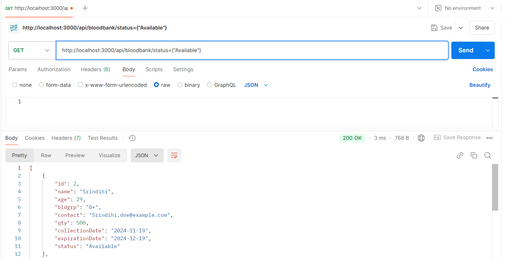
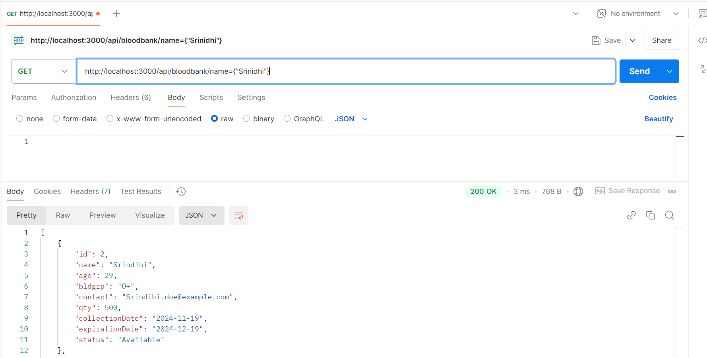

# Blood Bank API

A comprehensive Blood Bank API built with Node.js and Express to manage blood donation entries. This API provides functionalities to create, retrieve, update, delete, and sort blood bank records.

---

## Features

- **Add a new donor entry**: Record details of a blood donation.
- **Retrieve donor entries**: View all donor entries or a single entry by ID.
- **Update an entry**: Modify existing donor information.
- **Delete an entry**: Remove a donor record by ID.
- **Sort entries**: Sort blood bank entries by quantity or donor name.
- **Pagination**: Retrieve a paginated list of blood bank entries.
- **Search functionality**: Search by blood type, status, or donor name.

---
## Setup and Installation

1. Clone the repository:
   ```bash
   git clone https://github.com/YourUsername/BloodBankAPI.git
2. Navigate to the project directory:
    cd BLOODBANK
3. Perform basic setup:
    npm init
    npm install express
4. Start the server
    node server.js

## File Structure

```plaintext
BloodBank/
├── functions/
│   ├── index.js        # Contains all Blood Bank API logic and handlers
├── routes/
│   ├── bloodBankRoutes.js       # API routing 
|
├── server.js           # Main server entry point
|── Results             # Contains Postman screenshots
├── models/
│   ├── bloodBankEntry.js   # Blood bank entry 
|
├── package.json        # Node.js dependencies and project metadata
└── README.md           # Documentation for the API
```

### API Endpoints

| Method | Endpoint                                     | Description                                  |
|--------|---------------------------------------------|----------------------------------------------|
| GET    | `/api/bloodbank`                            | Retrieve all blood bank entries              |
| GET    | `/api/bloodbank/:id`                        | Retrieve a specific blood entry by ID        |
| POST   | `/api/bloodbank`                            | Add a new blood donor entry                  |
| PUT    | `/api/bloodbank/:id`                        | Update an existing blood donor entry by ID   |
| DELETE | `/api/bloodbank/:id`                        | Delete a blood donor entry by ID             |
| GET    | `/api/bloodbank?page={pageNumber}&size={pageSize}` | Retrieve a paginated list of blood bank entries |
| GET    | `/api/bloodbank/search?bloodType={bloodType}` | Search blood entries by blood type           |
| GET    | `/api/bloodbank/search?status={status}`      | Search blood entries by status               |
| GET    | `/api/bloodbank/search?donorName={donorName}` | Search blood entries by donor name           |


### Testing with Postman

### GET /api/bloodbank

##### This command retrieves all the blood bank entries available in the database.

### GET /api/bloodbank/:id

##### This command retrieves a particular blood donor entry based on the ID.

### POST /api/bloodbank

##### This command adds a new blood donor entry to the database.

### PUT /api/bloodbank/:id

##### Modify the blood donor details in place after matching based on the ID given in the request.

### DELETE /api/bloodbank/:id

##### Removes a blood donor entry from the database based on the ID given in the request.

### GET /api/bloodbank?page={pageNumber}&size={pageSize}

##### Retrieves a paginated list of blood bank entries based on the page number and size parameters.

### GET /api/bloodbank/search?bloodType={bloodType}

##### Retrieves blood donor entries based on the specified blood type.

### GET /api/bloodbank/search?status={status}

##### Retrieves blood donor entries based on their status (e.g., "Available", "Requested", "Expired").

### GET /api/bloodbank/search?donorName={donorName}

##### Retrieves blood donor entries for a specific donor based on their name.
